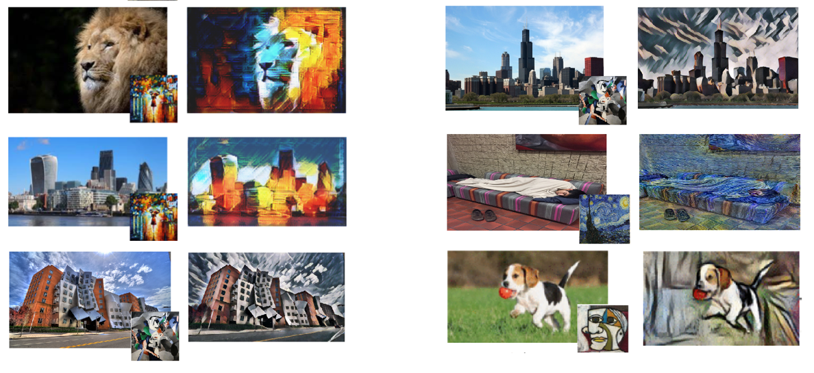

# Image-Style-Transfer
Remember using applications like Prisma, Snapseed, Lucid etc.? Ever wondered how these things works?

We give a photo from our camera roll, then we select a design to combine both the images and we get a resultant new image which has the **_content_** of our input image and **_style_** of the design image. In the world of deep learning this is called **Style transfer**

The **_style_** of a painting is: the way the painter used brush strokes; how these strokes form objects; texture of objects; color palette used.
The **_content_** of the image is what objects are present in this image (person, face, dog, eyes, etc.) and their relationships in space.

## Dependencies
- [Pre-trained VGG19 network](http://www.vlfeat.org/matconvnet/models/beta16/imagenet-vgg-verydeep-19.mat) 
    _(VGG19 – a 19 weight layer network, is trained on a subset of the ImageNet database, which consists of more than a million images and can classify images into many object categories. (Developed and trained by Oxford's renowned Visual Geometry Group)_
- [TensorFlow v1.9.0](https://www.tensorflow.org/install/#download-and-setup)
- [Numpy](https://github.com/numpy/numpy/blob/master/INSTALL.rst.txt) 
- [Scipy](https://github.com/scipy/scipy/blob/master/INSTALL.rst.txt)
- [Pillow or PIL (Python Imaging Library)](http://pillow.readthedocs.io/en/3.3.x/installation.html#installation)

## License
This project is licensed under the MIT License - see the [LICENSE.md](./LICENSE) file for details

## Acknowledgements
- [Anish Athalye : Neural style in TensorFlow!](https://github.com/anishathalye/neural-style)
- [Leon A. Gatys, Alexander S. Ecker, Matthias Bethge : A Neural Algorithm of Artistic Style](https://github.com/leongatys/fast-neural-style)
- [Justin Johnson, Alexandre Alahi, Li Fei-Fei : Perceptual losses for real-time style transfer and super-resolution](https://github.com/jcjohnson/fast-neural-style)
- [Logan Engstrom : TensorFlow CNN for fast style transfer](https://github.com/lengstrom/fast-style-transfer/)
- [Cameron Smith : TensorFlow (Python API) implementation of Neural Style ](https://github.com/cysmith/neural-style-tf)
